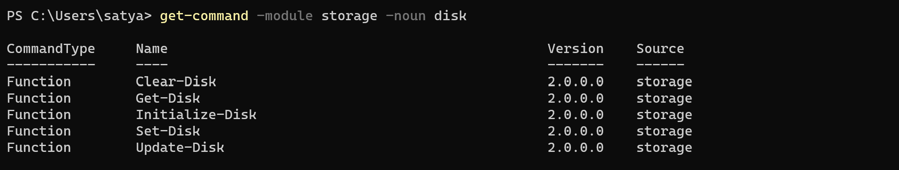

**List the files in the directory :**
        
        $get-childitem

**Copy file content to another file :**

        $copy-item demop.s1 demo1.ps1

**Print the content :**

        $write-host "Hello world"

**Input Value :**

        $read-host

**Get the Service status**

    $get-service
    $get-service | select-object name,status -> "to filter the name and status fo service"

**Sorting Objects:**

        $get-command -noun object --> to get multple object like compare-object , foreach-object, sort-object , tee-object , where-object, new-object, group-object , measure-object 

**Get process :**

        $get-process
        $get-process | select-object processname , id , cpu -> "filter objects"
        $get-process | select-object name , cpu | sort-object cpu --> "Sorting cpu wise"
        $get-process | select-object name , cpu | sort-object name --> "Sorting name wise"
        $get-process | select-object name , cpu | sort-object name | select-object -first 10 --> to get first ten
        $get-process | select-object name , cpu | select-object -first 10 | sort-object cpu -desc --> to get first ten with desceding order

**Get help :**

        $get-help sort-object --> "help of sort object"
        $get-process | select-object name , cpu | sort-object cpu -descending ---> "Sorting cpu wise desceding order or use(-desc)"

**Import CSV :**

        Note: read from file get output

        $import-csv service.csv | get-service
        or
        $get-service (import-csv service.csv | select-object -expandproperty name)

**Get cmd verbs :**

        Note: to get Mutliple verbs 
        $get-command -verb get --> like below
        
        Cmdlet          Get-WindowsCapability                              3.0        Dism
        Cmdlet          Get-WindowsDeveloperLicense                        1.0.0.0    WindowsDeveloperLicense
        Cmdlet          Get-WindowsDriver                                  3.0        Dism
        Cmdlet          Get-WindowsEdition                                 3.0        Dism
        Cmdlet          Get-WindowsErrorReporting                          1.0        WindowsErrorReporting
        Cmdlet          Get-WindowsImage                                   3.0        Dism

**PSM and PSD :**
       
        $module.psm  #"--> Stands for powershell module"
        $Definition.psd  #"--> Stands for powershell definition"

